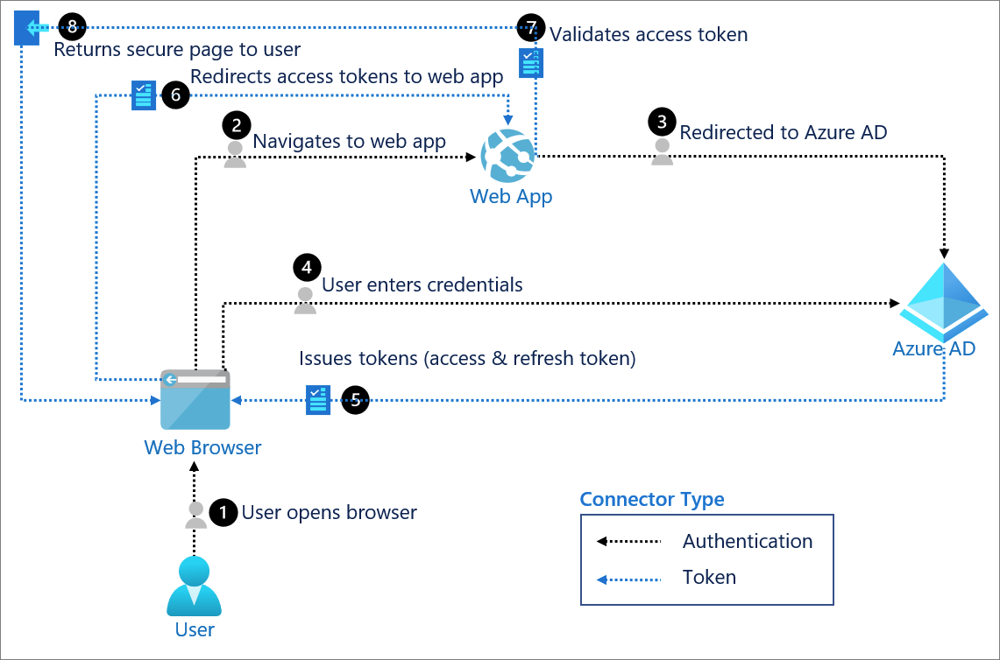

# Ejemplo simple de autenticación en Azure AD Oauth2 PHP

Este es un ejemplo de autenticación Azure AD Oauth2 usando php, este ejemplo lo encontre buscando en internet formas de lograr la autenticación con azure ad. Este documento es una adaptación al español de la siguiente página [https://www.sipponen.com/archives/4024](https://www.sipponen.com/archives/4024)  

## Documentación

La documentación oficial esta Oauth2  en los siguientes enlaces:

[https://docs.microsoft.com/es-es/azure/active-directory/develop/sample-v2-code](https://docs.microsoft.com/es-es/azure/active-directory/develop/sample-v2-code)  
[https://docs.microsoft.com/es-es/azure/active-directory/develop/v2-oauth2-auth-code-flow](https://docs.microsoft.com/es-es/azure/active-directory/develop/v2-oauth2-auth-code-flow)  
[https://docs.microsoft.com/es-es/azure/active-directory/fundamentals/auth-oauth2](https://docs.microsoft.com/es-es/azure/active-directory/fundamentals/auth-oauth2)  
[https://docs.microsoft.com/es-es/graph/permissions-reference](https://docs.microsoft.com/es-es/graph/permissions-reference)  
[https://developer.microsoft.com/es-es/graph/graph-explorer](https://developer.microsoft.com/es-es/graph/graph-explorer)  
[https://docs.microsoft.com/es-es/rest/api/azure/](https://docs.microsoft.com/es-es/rest/api/azure/)  
[https://code.visualstudio.com/#alt-downloads](https://code.visualstudio.com/#alt-downloads)  

El escenario que se esta implementando el es el siguiente:


[Tomado de https://docs.microsoft.com/es-es/azure/active-directory/fundamentals/auth-oauth2 (2021-05-25)](https://docs.microsoft.com/es-es/azure/active-directory/fundamentals/auth-oauth2)

## Ejemplo de un scrip del lado del cliente de autenticación

``` php
<?php
//This login script is based on Sami Sipponen's Simple Azure Oauth2 Example with PHP:
//https://www.sipponen.com/archives/4024

session_start();  //Since you likely need to maintain the user session, let's start it an utilize it's ID later
error_reporting(-1);  //Remove from production version
ini_set("display_errors", "on");  //Remove from production version

//Configuration, needs to match with Azure app registration
$client_id = "00000000-0000-0000-0000-000000000000";  //Application (client) ID
$ad_tenant = "00000000-0000-0000-0000-000000000000";  //Azure Active Directory Tenant ID, with Multitenant apps you can use "common" as Tenant ID, but using specific endpoint is recommended when possible
$client_secret = "azure-app-secret-from-your-app-registration";  //Client Secret, remember that this expires someday unless you haven't set it not to do so
$redirect_uri = "https://your-server.your-domain.com/this-page.php";  //This needs to match 100% what is set in Azure
$error_email = "your.email@your-domain.com";  //If your php.ini doesn't contain sendmail_from, use: ini_set("sendmail_from", "user@example.com");

function errorhandler($input, $email)
{
  $output = "PHP Session ID:    " . session_id() . PHP_EOL;
  $output .= "Client IP Address: " . getenv("REMOTE_ADDR") . PHP_EOL;
  $output .= "Client Browser:    " . $_SERVER["HTTP_USER_AGENT"] . PHP_EOL;
  $output .= PHP_EOL;
  ob_start();  //Start capturing the output buffer
  var_dump($input);  //This is not for debug print, this is to collect the data for the email
  $output .= ob_get_contents();  //Storing the output buffer content to $output
  ob_end_clean();  //While testing, you probably want to comment the next row out
  mb_send_mail($email, "Your Azure AD Oauth2 script faced an error!", $output, "X-Priority: 1\nContent-Transfer-Encoding: 8bit\nX-Mailer: PHP/" . phpversion());
  exit;
}

if (isset($_GET["code"])) echo "<pre>";  //This is just for easier and better looking var_dumps for debug purposes

if (!isset($_GET["code"]) and !isset($_GET["error"])) {  //Real authentication part begins
  //First stage of the authentication process; This is just a simple redirect (first load of this page)
  $url = "https://login.microsoftonline.com/" . $ad_tenant . "/oauth2/v2.0/authorize?";
  $url .= "state=" . session_id();  //This at least semi-random string is likely good enough as state identifier
  $url .= "&scope=User.Read";  //This scope seems to be enough, but you can try "&scope=profile+openid+email+offline_access+User.Read" if you like
  $url .= "&response_type=code";
  $url .= "&approval_prompt=auto";
  $url .= "&client_id=" . $client_id;
  $url .= "&redirect_uri=" . urlencode($redirect_uri);
  header("Location: " . $url);  //So off you go my dear browser and welcome back for round two after some redirects at Azure end

} elseif (isset($_GET["error"])) {  //Second load of this page begins, but hopefully we end up to the next elseif section...
  echo "Error handler activated:\n\n";
  var_dump($_GET);  //Debug print
  errorhandler(array("Description" => "Error received at the beginning of second stage.", "\$_GET[]" => $_GET, "\$_SESSION[]" => $_SESSION), $error_email);
} elseif (strcmp(session_id(), $_GET["state"]) == 0) {  //Checking that the session_id matches to the state for security reasons
  echo "Stage2:\n\n";  //And now the browser has returned from its various redirects at Azure side and carrying some gifts inside $_GET
  var_dump($_GET);  //Debug print

  //Verifying the received tokens with Azure and finalizing the authentication part
  $content = "grant_type=authorization_code";
  $content .= "&client_id=" . $client_id;
  $content .= "&redirect_uri=" . urlencode($redirect_uri);
  $content .= "&code=" . $_GET["code"];
  $content .= "&client_secret=" . urlencode($client_secret);
  $options = array(
    "http" => array(  //Use "http" even if you send the request with https
      "method"  => "POST",
      "header"  => "Content-Type: application/x-www-form-urlencoded\r\n" .
        "Content-Length: " . strlen($content) . "\r\n",
      "content" => $content
    )
  );
  $context  = stream_context_create($options);
  $json = file_get_contents("https://login.microsoftonline.com/" . $ad_tenant . "/oauth2/v2.0/token", false, $context);
  if ($json === false) errorhandler(array("Description" => "Error received during Bearer token fetch.", "PHP_Error" => error_get_last(), "\$_GET[]" => $_GET, "HTTP_msg" => $options), $error_email);
  $authdata = json_decode($json, true);
  if (isset($authdata["error"])) errorhandler(array("Description" => "Bearer token fetch contained an error.", "\$authdata[]" => $authdata, "\$_GET[]" => $_GET, "HTTP_msg" => $options), $error_email);

  var_dump($authdata);  //Debug print

  //Fetching the basic user information that is likely needed by your application
  $options = array(
    "http" => array(  //Use "http" even if you send the request with https
      "method" => "GET",
      "header" => "Accept: application/json\r\n" .
        "Authorization: Bearer " . $authdata["access_token"] . "\r\n"
    )
  );
  $context = stream_context_create($options);
  $json = file_get_contents("https://graph.microsoft.com/v1.0/me", false, $context);
  if ($json === false) errorhandler(array("Description" => "Error received during user data fetch.", "PHP_Error" => error_get_last(), "\$_GET[]" => $_GET, "HTTP_msg" => $options), $error_email);
  $userdata = json_decode($json, true);  //This should now contain your logged on user information
  if (isset($userdata["error"])) errorhandler(array("Description" => "User data fetch contained an error.", "\$userdata[]" => $userdata, "\$authdata[]" => $authdata, "\$_GET[]" => $_GET, "HTTP_msg" => $options), $error_email);

  var_dump($userdata);  //Debug print
} else {
  //If we end up here, something has obviously gone wrong... Likely a hacking attempt since sent and returned state aren't matching and no $_GET["error"] received.
  echo "Hey, please don't try to hack us!\n\n";
  echo "PHP Session ID used as state: " . session_id() . "\n";  //And for production version you likely don't want to show these for the potential hacker
  var_dump($_GET);  //But this being a test script having the var_dumps might be useful
  errorhandler(array("Description" => "Likely a hacking attempt, due state mismatch.", "\$_GET[]" => $_GET, "\$_SESSION[]" => $_SESSION), $error_email);
}
echo "\n<a href=\"" . $redirect_uri . "\">Click here to redo the authentication</a>";  //Only to ease up your tests
?>
```

Este codigo contiene la funcionalidad basica para lograr la autenticación basica usando oauth2, para usarlo en producción se deben eliminar los mensajes de comentario.

## Crear una aplicación en el Azure ad (traduccion automatica)

Despues de crear la aplicacion de autenticacion debe crear una aplicacion dentro del azure ad los pasos para crearla son los siguientes:

Simplemente abra https://aad.portal.azure.com o https://portal.azure.com y abra "Azure Active Directory" allí.  

-Desde el menú de la izquierda en la sección Administrar, abra "Registros de aplicaciones".  

A continuación, haga clic en "+ Nuevo registro" en la parte superior de la vista que acaba de abrir.  

Ahora puede ingresar el nombre de su aplicación y seleccionar su aplicación Single tenant o Multitenant. Y esta selección, por supuesto, depende de qué tan públicamente quiera compartir esta aplicación. Si no está seguro, seleccione Inquilino único para estar seguro. Puede cambiar esto más tarde si es necesario desde la página "Autenticación". Lo más importante en esta vista es proporcionar el URI de redireccionamiento a su página de autenticación (la página que contiene mi código de ejemplo). Esto debe protegerse con HTTPS, así que ni siquiera se moleste en intentarlo solo con http: //, ya que no funcionará. Sin embargo, esta URL no necesita estar disponible públicamente, ya que su navegador accede a ella, no el propio Azure, por lo que incluso localhost funcionará siempre que tenga una conexión https: //.

Dado que ahora ha creado el registro de la aplicación y se encuentra en la página "Descripción general", copie su ID de aplicación (cliente) y su ID de directorio (inquilino), ya que los necesitará con mi código de ejemplo.

¡Y ahora estás casi listo! Solo queda una última cosa por hacer, que es crear el "secreto del cliente" para su aplicación registrada. Haga clic en "Certificados y secretos" en el menú de la izquierda y en la página que se abre, haga clic en el botón "+ Nuevo secreto de cliente". Ahora puede dar una descripción si lo desea, pero lo principal aquí es seleccionar cuánto tiempo es válido su secreto. Una vez que haya seleccionado, simplemente haga clic en el botón "Agregar" y ahí lo tiene. Tenga en cuenta que Azure no le mostrará el secreto después, por lo que debe copiarlo ahora en un lugar seguro o crear uno nuevo si lo perdió.

## Contributing

Pull requests are welcome. For major changes, please open an issue first to discuss what you would like to change.

Please make sure to update tests as appropriate.

## Licencia

No hay licencia para este código, ya que se ha pensado solo como ejemplo. Siéntase libre de utilizarlo como desee, incluso comercialmente, pero recuerde que no me hago responsable de este código, lo que significa que debe usarlo bajo su propio riesgo.

Esta publicación no tiene relación con mi actividad laboral es una actividad personal.
